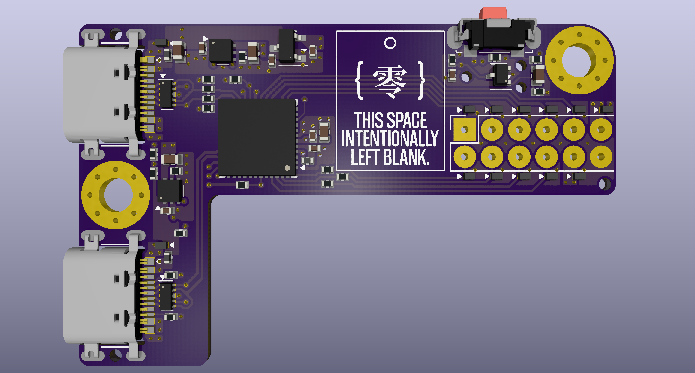
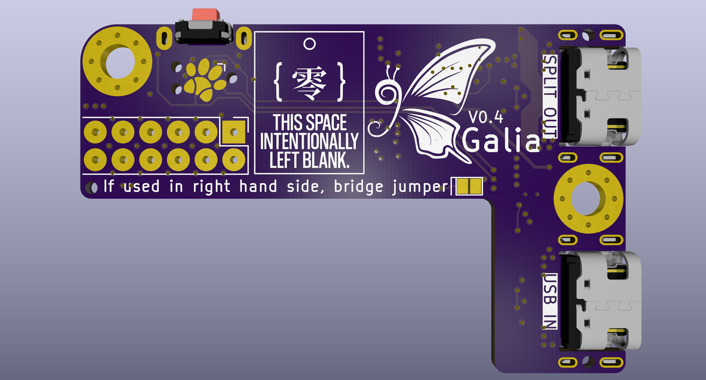

# Galia
Modular split ergonomic keyboard system with each half consisting of a central motherboard and a hot-swappable key cluster daughterboard to allow for maximum flexibility.

### Motherboard

- Current version: V0.4.
- Schematic [here](https://kicanvas.org/?repo=https%3A%2F%2Fgithub.com%2Fghostlybutterfly%2FGalia%2Fblob%2FV0_dev%2FMotherboard%2FMotherboard.kicad_sch). 
- Board layout [here](https://kicanvas.org/?repo=https%3A%2F%2Fgithub.com%2Fghostlybutterfly%2FGalia%2Ftree%2FV0_dev%2FMotherboard).
### Daughterboard (Cantaloupe)
Current version: N/A (wip).

## Disclaimer
This keyboard is licensed under [CERN-OHL-S-2.0](https://cern-ohl.web.cern.ch/) and is compatible with both [QMK Firmware](https://qmk.fm/) and [ZMK Firmware](https://zmk.dev).

## Key Features
### Motherboard
* Fully reversible, compact (32.0x50.0mm), and designed to fit onto the top inner corner of a split keyboard.
* On-board STM32G0B1CCU7 processor.
* ESD-protected USB-C input port and USB-C split comms port.
* Connects to daughterboard through fully ESD-protected 2.54mm pitch 02x06 pogo header.
* SPI and USART lines terminated with 22ohm to reduce ringing, overshoot and EMI, and improve signal integrity.
* VBUS input rail limited to ~469mA and 5V output rail limited to ~179mA through the use of TPS2553-1 current limiting switches with reverse voltage protection. VBUS requires power cycling to restart the device upon overcurrent, +5V can be power-cycled through firmware with EN pin controlled through firmware to reduce RGB LED quiescent current draw.
* 4-layer (signal/ground/power/signal) PCB and star ground connection point in between USB port shields.
* [Paw-Connect](https://github.com/LeoDJ/Paw-Connect) TC-2030NL SWD header for debugging purposes.
* On-board single-button reset circuit.
* JLC basic assembly compatible as long as USB ports are not soldered on.

### Daughterboard (TBC)
* Matrix scan planned to be implemented through 74HC595 SIPO shift registers for low power draw and compatibility with ZMK interrupt functionality.
* Also compatible with charlieplex, duplex, and standard matrix layouts.
* WS2812 and AP102 (QMK only) LED support.
* Additional [VIK](https://github.com/sadekbaroudi/vik) header support if desired.

## Pogo header pinout
| Function/description                 | Pin name | Row 1 | Row 2 | Pin name | Function/description                  |
| ------------------------------------ | -------- | ----- | ----- | -------- | ------------------------------------- |
| USART2_TX/ADC1_IN2/TIM2_CH3          | A2       | GPIO1 | CS    | B9       | SPI2_NSS/I2C1_SDA/USART3_RX/TIM4_CH4  |
| USART2_RX/ADC1_IN3/TIM2_CH4          | A3       | GPIO2 | SCK   | B8       | SPI2_SCK/I2C1_SCL/USART3_TX/TIM4_CH3  |
| SPI1_SCK/ADC1_IN5/TIM2_CH1           | A5       | GPIO3 | MOSI  | B7       | SPI2_MOSI/I2C1_SDA/USART1_RX/TIM4_CH2 |
| SPI1_MISO/ADC1_IN6/I2C2_SDA/TIM3_CH1 | A6       | GPIO4 | MISO  | B6       | SPI2_MISO/I2C1_SCL/USART1_TX/TIM1_CH3 |
| SPI1_MOSI/ADC1_IN7/I2C2_SCL/TIM3_CH2 | A7       | GPIO5 | +5V   | N/A      | ~207mA max draw by daughterboard      |
| 200mA max draw by this side overall  | N/A      | VDD   | GND   | A7       | GND                                   |

## Changelog
* 2026/09/30: V0.4 motherboard update complete. Removed guard ring around the edge of the board. Moved reset button and pogo header down the board. Increased length back to 50mm to allow for an E73-2G4M08S1C version to be developed if desired. Simplified reset circuit - doesn't use the Acheron version anymore. Reduced number of pins in pogo header, as the largest available ones are 2x06. Pinout of pogo header changed to greatly simplify routing - no longer VIK-compliant. Signalis reference and Paw-Connect added back. Changed file structure.
* 2026/09/26: V0.3 motherboard update complete. Reduced size again, rerouted board and changed shape slightly. Removed one mounting hole and centred the other between the USB ports. Changed input fuse and external +5V output to TPS2553-1 latching power switch with reverse voltage/current protection. Removed AO3401 and LMV321 discrete reverse current protection at VBUS input. Reduced size of VBUS and VSPLIT ferrite bead and transistors in the Acheron reset circuit. Made Acheron reset circuit reach DFU faster. 
* 2026/09/21: V0.2 motherboard update complete. Significantly decreased size. GPIO3, GPIO4 and GPIO5 pins changed. Increased size of pogo pin header pads. Removed extra IO header. Replaced 2x03 2.54mm programming header and TC2030-NL with 2x05 1.27mm Samtec IDC header. Replaced reset switch with smaller Alps SKSNLP mid-mount switch. Added layer marker. Changed repository file structure.
* 2026/09/17: Fixed gap in guard rail.
* 2026/09/16: V0.1 motherboard initial commit.